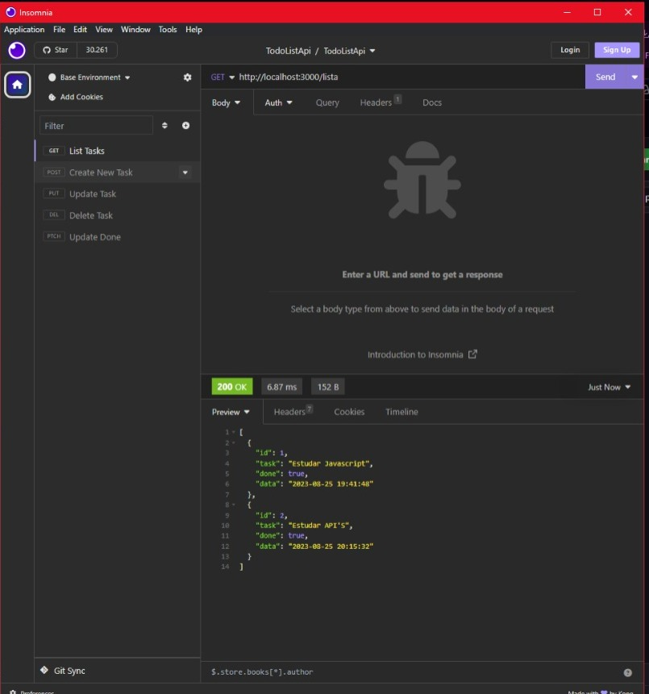

### 📝 TodoList-API

## 💻 Tecnologias utilizadas: 

 

*Versão do Node: v18.14.2*

### Utilizei o Insomnia para realizar as requisições: 

### *Uma API de lista de tarefas* criada com NodeJS e Express. Onde vai existir um *ID*, *tarefas em texto*, *boolean "true" ou "false" sendo true para tarefa concluída e false para tarefa não concluída* e *uma data, para saber a data de criação da tarefa*.

***

## O projeto foi inicializado com os seguintes comandos no terminal: 
**"*npm init -y*"**  para criar o arquivo package.json

 **"*npm install express*"** para instalar o express e criar a pasta "node_modules" *Versão: 4.18.2*

 **"*npm install -d nodemon*"** para instalar o nodemon como dependencia do desenvolvedor e monitorar as mudanças sem ter que ficar reiniciando o servidor. *Versão: 3.0.1*
 
 **"*npm install date-fns*"** para instalar um package que ajuda na formatação de datas.  *Versão : 2.30.0*

### O projeto foi organizado pela pastas 📂:

### *src* - Pasta raiz onde vai conter as pastas como controllers, dataBase, routes e o arquivo index.js que é o servidor.

### *controllers*: contém os arquivos das funcionalidades, como:

   **-listTasks:** *Função que listará todas as taks existentes na API.* 

   
   
   **-createTask:** *Função que criará uma nova task na API.*
   
   **-updateTask:** *Função que atualizará a task e o done através ID do objeto.*
   
   **-updateDone:** *Função que atualizará apenas o done através do ID. (true ou false).*
   
   **-deleteTask:** *Função que deletará da API apenas a task do ID selecionado.*

### *dataBase*: Conterá os dados da API... Com um array contendo objetos com: id, task, done e data .

### *routes*: Conterá o arquivo de rotas da API.

### *arquivo index.js*: Vai conter o código de criação do servidor utilizando o express, importação do arquivo da rota e o número da porta que o servidor irá rodar.

*utilizei o arquivo .gitignore para poder ignorar a pasta node_modules ao enviar o projeto para o GitHub.*
